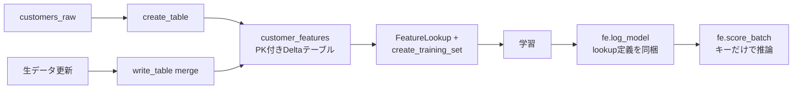

Databricks の Feature Store（Feature Engineering in Unity Catalog）を、最小構成のデモから始めて「作成 → 利用 → MLflow 連携 → Point-in-time 結合 → 更新専用パイプライン」まで一通り試した。デプロイはすべて Databricks Asset Bundles（DABs）で行い、Serverless compute で実行した。

この記事はその過程のまとめ。ハマった点（Serverless 限定ワークスペース、依存パッケージ不足など）も含めて書く。

コード一式は GitHub に置いてある。

- リポジトリ: https://github.com/taka110811/feature_store_demo

## 前提と構成

- Unity Catalog 有効なワークスペース（Serverless compute のみ対応）
- ローカルに Databricks CLI（bundle 対応）
- API は現行の `databricks.feature_engineering`（`FeatureEngineeringClient`）

プロジェクト構成は次のとおり。ノートブックはソース形式の `.py` で、DABs の Job から参照する。

```
feature_store_demo/
  databricks.yml
  resources/
    job_feature_store_demo.yml
  src/notebooks/
    01_setup_and_data.py            # UC セットアップ + 合成生データ
    02_create_feature_table.py      # Feature Table 作成
    03_train_with_features.py       # FeatureLookup で学習
    04_consume_existing_features.py # 既存 Feature Table の利用のみ
    05_mlflow_feature_store.py      # MLflow 連携（log_model / score_batch）
    06_point_in_time_join.py        # Point-in-time 結合
    07a_update_raw_data.py          # 生データ更新のみ
    07b_merge_feature_table.py      # Feature Table merge のみ
  README.md
```

### databricks.yml

`catalog` / `schema` は Bundle variables にして、Job parameter → widgets でノートブックに渡す。

```yaml
bundle:
  name: feature_store_demo

variables:
  catalog:
    default: fs_demo
  schema:
    default: feature_store

include:
  - resources/*.yml

targets:
  dev:
    mode: development
    default: true
    workspace:
      host: https://xxx.cloud.databricks.com
      profile: my_profile
```

## ハマりどころ（先に書いておく）

### 1. Serverless 限定ワークスペースでは job_clusters が使えない

最初は ML Runtime のジョブクラスタを定義していたが、deploy で弾かれた。

```
Error: cannot create resources.jobs.feature_store_offline_demo:
Only serverless compute is supported in the workspace. (400 INVALID_PARAMETER_VALUE)
```

対処は `job_clusters` を消して `environments` に切り替えること。

```yaml
environments:
  - environment_key: default
    spec:
      environment_version: "3"
      dependencies:
        - scikit-learn
        - databricks-feature-engineering
tasks:
  - task_key: create_feature_table
    environment_key: default
    notebook_task:
      notebook_path: ../src/notebooks/02_create_feature_table.py
```

### 2. Serverless には databricks-feature-engineering が入っていない

ML Runtime ならプリインストールだが、Serverless の Standard 環境には入っていない。

```
ModuleNotFoundError: No module named 'databricks.feature_engineering'
```

上記のとおり `environments.spec.dependencies` に `databricks-feature-engineering` を追加すれば解決する。Serverless は init script 非対応なので、依存はすべてここで宣言する。

### 3. bundle run は deploy しない

`databricks bundle run` は**デプロイ済みの Job を起動するだけ**。コードや YAML を変えたら毎回 `deploy` してから `run` する。

```bash
databricks bundle validate -t dev
databricks bundle deploy -t dev
databricks bundle run <job_name> -t dev
```

## Step 1: Feature Table の作成（Producer）

UC では「主キー制約付きの Delta テーブル = Feature Table」。専用のストレージがあるわけではない。

合成した顧客データ（`customers_raw`、ラベル `churned` 含む）から特徴量を計算し、`create_table` で登録する。

```python
from databricks.feature_engineering import FeatureEngineeringClient

fe = FeatureEngineeringClient()
fe.create_table(
    name=f"{catalog}.{schema}.customer_features",
    primary_keys=["customer_id"],
    df=features_df,
    description="Customer offline features for churn demo",
)
```

ポイントは 2 つ。

- **ラベル列（`churned`）は Feature Table に入れない**（リーク防止）
- 再実行できるよう「存在すれば `write_table(mode="merge")`」にフォールバックする

登録すると、サイドバーの **Features** 画面（カタログ選択）に表示される。Catalog Explorer だと普通のテーブルに見えるので、「Feature Table として認識されているか」は Features UI で確認するのがよい。

## Step 2: 既存 Feature Table の利用（Consumer）

Feature Store の「利用」は、手動 JOIN ではなく `FeatureLookup` + `create_training_set` で行う。手元にあるのはキー（とラベル）だけでよい。

```python
from databricks.feature_engineering import FeatureLookup

labels_df = spark.table(raw_table).select("customer_id", "churned")

training_set = fe.create_training_set(
    df=labels_df,
    feature_lookups=[
        FeatureLookup(
            table_name=feature_table,
            lookup_key="customer_id",  # 手元 DF と Feature Table を繋ぐキー
            feature_names=["tenure_months", "monthly_charges",
                           "avg_monthly_spend", "support_ticket_rate"],
        )
    ],
    label="churned",
)
training_df = training_set.load_df()
```

`lookup_key` は SQL の `ON` 句に相当する。通常は Feature Table の主キーと同名の列を指定する。

特徴量の計算ロジックは Producer 側にあり、Consumer は**名前とキーだけで再利用**できる。ここが Feature Store の分業ポイント。

## Step 3: MLflow 連携（log_model / score_batch）

ここが一番「Feature Store らしい」ところ。`fe.log_model` でモデルを記録すると、**FeatureLookup の定義がモデルに同梱される**。

```python
import mlflow

mlflow.set_registry_uri("databricks-uc")

with mlflow.start_run():
    fe.log_model(
        model=model,
        artifact_path="model",
        flavor=mlflow.sklearn,
        training_set=training_set,
        registered_model_name=f"{catalog}.{schema}.customer_churn_model",
    )
```

推論側は **主キーだけ**の DataFrame を渡せば、特徴量は自動 lookup される。

```python
# inference_df の列は customer_id だけ
predictions_df = fe.score_batch(model_uri=model_uri, df=inference_df)
```

学習時と推論時で同じ特徴量定義が使われることが保証されるので、training-serving skew を防げる。

### 余談: モデルが Functions にも見える

UC に登録したモデルは、Catalog Explorer の **Models** と **Functions** の両方に現れる。これは registered model が UC 上 `FUNCTION` セキュラブルのサブタイプだから。権限も `GRANT ... ON FUNCTION` で付ける。二重登録ではないので、見るときは Models 側を開けばよい。

## Step 4: Point-in-time 結合

Feature Store の本番価値はここにあると思う。時系列 Feature Table を作ると、ラベル時点**以前**の最新特徴量だけを結合できる（未来リーク防止）。

時系列 Feature Table は `timeseries_columns` を指定して作る。主キーに時刻列も含める。

```python
fe.create_table(
    name=f"{catalog}.{schema}.customer_features_ts",
    primary_keys=["customer_id", "feature_ts"],
    timeseries_columns="feature_ts",  # これで point-in-time 対応になる
    df=features_df,
)
```

lookup 側は `timestamp_lookup_key` にラベル側の as-of 時刻列を指定する。

```python
FeatureLookup(
    table_name=feature_table_ts,
    lookup_key="customer_id",
    timestamp_lookup_key="label_ts",  # この時点以前の最新値を取る
    feature_names=[...],
)
```

デモでは顧客ごとに day 0 / 30 / 60 のスナップショットを持たせ、ラベルを day 45 に置いた。結果は全件 **day 30 の特徴量**が選ばれ、day 60（未来）は 1 件も混ざらなかった。

```
Matched day-30 (correct PIT): 20/20
Matched day-60 (would be leakage): 0/20
```

exact match の JOIN では day 45 に一致する行がなく全滅するし、素朴に最新値を取ると day 60 がリークする。`timestamp_lookup_key` はそのどちらでもなく「as-of join」をやってくれる。

## Step 5: 更新専用パイプライン

実運用では「Feature Table を作る Job」と「更新する Job」は分かれる。デモでは次の 2 タスクに分けた。

1. **生データ更新のみ** — 新規顧客 20 件を追加し、既存の一部を変更。Feature Table には触らない
2. **Feature Table merge のみ** — 変更のあった `customer_id` だけ特徴量を再計算して `write_table(mode="merge")`。`create_table` は呼ばない

```python
# 更新 Job では create_table しない。存在しなければ失敗させる
fe.get_table(name=feature_table)  # 存在チェック

fe.write_table(
    name=feature_table,
    df=features_changed_df,  # 変更分のみ
    mode="merge",
)
```

`mode="merge"` は主キーで upsert される。新規 ID は挿入、既存 ID は更新。スケジュール実行するならこの更新 Job だけを回せばよい。

## 全体の流れまとめ



## 学び

- UC の Feature Store は独立したストアではなく、**主キー付き Delta テーブル + クライアント API** という薄い作り。導入の敷居は低い
- 価値が出るのは「利用」側。`FeatureLookup` による定義の再利用、`log_model` / `score_batch` による学習・推論の一貫性、`timestamp_lookup_key` によるリーク防止
- Serverless 前提のワークスペースでは、DABs の Job 定義を `environments` ベースにし、`databricks-feature-engineering` を依存に明示する
- `bundle run` は deploy を含まない。変更したら `deploy` → `run`

次は Online Store + Model Serving でリアルタイム推論まで繋げたい。
