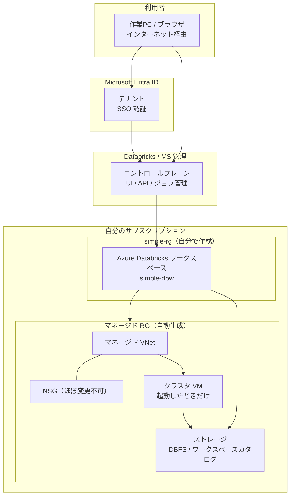

社内向けの VNet インジェクションや Unity Catalog 用ストレージの別建てを一切せず、**Azure のデフォルトのまま** Databricks を建てるとどうなるかをまとめた。  
ゴールは「ワークスペースに入れるところまで」と、そのとき裏側で何が立つのかの把握。

## 前提

- Azure サブスクリプション（Owner など作成権限あり）
- Azure CLI（`az`）が使えること
- リージョン例: `japaneast`

## 完成形（デフォルト構築）

自分で作るのはリソースグループとワークスペース定義だけ。VNet / NSG / ストレージはマネージド RG に自動生成される。



ポイントだけ先に書く。

- **コントロールプレーン本体は自分の RG には無い**（Databricks 側）
- ポータルで見える本体は `Microsoft.Databricks/workspaces` と、紐づくマネージド RG
- クラスタ VM は **Compute を起動するまでほぼ作られない**

## 手順

### 1. ログインとサブスクリプション選択

```powershell
az login
az account show -o table
# 必要なら
az account set --subscription "<サブスクリプションID>"
```

### 2. リソースグループ作成

```powershell
az group create -n simple-rg -l japaneast
```

### 3. ワークスペース作成（Premium）

```powershell
az databricks workspace create `
  -g simple-rg `
  -n simple-dbw `
  -l japaneast `
  --sku premium
```

初回は `Microsoft.Databricks` プロバイダー登録が走り、その後 `- Running ..` が続く。  
体感 **5〜15 分**が多い。

SKU の選び方:

| SKU | 用途 |
|-----|------|
| `standard` | ノートブック・クラスタなど最小機能 |
| `premium` | Unity Catalog や IP アクセスリスト等も試したいとき |
| `trial` | Premium 相当の短期試用 |

今回は後から機能を触りやすいよう `premium` にした。

### 4. 作成確認

```powershell
# Succeeded ならOK
az databricks workspace show -g simple-rg -n simple-dbw --query provisioningState -o tsv

# ワークスペース URL
az databricks workspace show -g simple-rg -n simple-dbw --query workspaceUrl -o tsv

# マネージド RG の場所
az databricks workspace show -g simple-rg -n simple-dbw --query managedResourceGroupId -o tsv
```

マネージド RG 内の実体:

```powershell
$mrg = az databricks workspace show -g simple-rg -n simple-dbw --query managedResourceGroupId -o tsv
$mrgName = ($mrg -split '/')[-1]
az resource list -g $mrgName -o table
```

Azure Portal では次のどれか。

1. 検索で `simple-dbw`
2. リソースグループ `simple-rg` → `simple-dbw`
3. 概要の **ワークスペースの起動** から UI を開く

## 認証（Entra ID）について

**Azure Databricks は既定で Microsoft Entra ID SSO** になっている。  
「Entra ID 連携を別途有効化する」作業は、この素構築では不要。

- ワークスペース作成者が管理者として入れる
- テナント内の全員が自動で入れるわけではない
- AWS/GCP 版 Databricks の話とは別（Azure だから Entra が既定）

社内の共有 Azure（独自テナント運用）では、O365 テナントと Azure 用テナントが分かれていることがあり、ユーザー追加や権限付与の運用が別途必要になる。私用サブスクの素構築では、作成アカウントでそのまま入れる。

## 疎通確認

課金を抑えるなら、まずはクラスタなしで十分。

1. `workspaceUrl` をブラウザで開く
2. Entra ID でログインできる
3. 左メニュー（Workspace / Catalog / Compute など）が見える

ここまでで **UI ⇔ コントロールプレーン** の疎通は確認できる。

Spark まで見る場合だけ:

1. Compute → シングルノード、Autotermination 30 分で作成
2. ノートブックで次を実行

```python
spark.range(1).show()
```

終わったらクラスタは **Terminate**。

## 課金の感覚

| 状態 | 課金感 |
|------|--------|
| ワークスペース作成＋ログインのみ | 大きな従量はほぼ無し |
| マネージド RG のストレージ | ごく少額が発生しうる |
| クラスタ / SQL Warehouse が Running | VM + DBU で本番課金 |

「疎通＝ログインだけ」なら、実質ほぼ未課金と思ってよい。完全な 0 円保証ではない。

## このコマンドが作っているものの実態

`az databricks workspace create` がやっていることは、ざっくり次の通り。

1. 必要なら `Microsoft.Databricks` を登録
2. `simple-rg` にワークスペースリソースを作成
3. マネージド RG を自動作成
4. マネージド VNet / NSG / ストレージを配備
5. Databricks 側コントロールプレーンにワークスペースを紐づけ
6. `workspaceUrl` を発行

自分のサブスクに見えるもの / 見えないもの:

| 区分 | 内容 |
|------|------|
| 見える | `simple-dbw`、マネージド RG（VNet / NSG / Storage、後から Cluster VM） |
| 見えない | コントロールプレーン本体、サーバーレス側の実行基盤 |

つまり「コントロールプレーンを RG に立てた」のではなく、**入口とクラシック用の裏方箱を自分のサブスクに用意し、制御本体は Databricks 側**、という形。

## 社内向け構成との違い（参考）

素構築は把握用として強いが、本番寄り設計とはここが違う。

| 項目 | 素の構成（今回） | よくある社内寄り構成 |
|------|------------------|----------------------|
| VNet | マネージド（触れない） | 自前 VNet へインジェクション |
| ストレージ | マネージド（NW設定ほぼ変更不可） | UC 用などを別建て |
| ユーザーアクセス | どこからでも（制限なし） | IP アクセスリスト等 |
| 見えるリソース | WS + マネージド RG | WS + 自前 NW / PE / ストレージが増える |

## 片付け

検証が終わったらまとめて消せる。

```powershell
az group delete -n simple-rg --yes
```

マネージド RG もワークスペース削除に追随して消える想定。残っていたら Cost を見て確認する。

## まとめ

- `az group create` と `az databricks workspace create --sku premium` だけで素の環境は立つ
- ポータルで見るべきなのは `simple-rg` のワークスペースと、自動生成マネージド RG
- ログインできれば疎通確認としては十分
- 本課金の本体はクラスタ起動後

「まず動く箱」を手元に置いてから、VNet インジェクションや IP 制限、Unity Catalog の設計差分を比較する、という順番が取りやすい。
