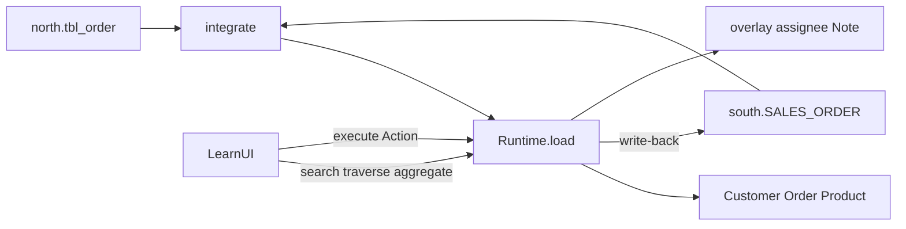

Palantir Foundry のオントロジーは、データを見るためのセマンティック層ではない。業務の名詞・関係・動詞をモデルにし、読みはモデルを辿り、書きは Action だけが通る層だ。

その概念をミニマムに実装した OSS が [gura105/operational-ontology](https://github.com/gura105/operational-ontology) で、実測記事もある。

- 本家: https://github.com/gura105/operational-ontology
- 実測: [Palantir Foundryのオントロジーをミニマムに再現したOSSを実測検証した](https://zenn.dev/mskbhd/articles/lab-198-gura105-operational-ontology-o)

本家にはすでに `pnpm demo` がある。ターミナルログとしては十分だが、**どの状態がソース由来で、どれがオントロジー所有か**、**拒否のあと SoR が動いたかどうか** を同時に見にくい。そこで Runtime は変えず、同じ orders シナリオを日本語の学習 UI で包んだ。

この記事はそのデモで何が見えるかのまとめ。公式 Foundry の解説ではなく、パターンを手元で辿った記録。

## 結論（先に）

Operational Ontology がセマンティック層と違う点は、次の4つが同時に成り立つこと。

| 性質 | 一言 |
| --- | --- |
| Semantic objects and links | スキーマの違う物理データを、業務オブジェクトと関係として読む |
| Action-gated writes | 更新の入口は名前付き Action だけ。生 SQL の UPDATE は出さない |
| Business rules at the action | 事前条件が業務ルールを拒否し、成功も失敗も監査する |
| Write-back + ownership | 誰が真実を持つかを宣言する。ソース所有は SoR へ戻し、オントロジー所有は再取込後も残る |

本家 README のクイックテストが分かりやすい。

> Can you cancel an order from your semantic layer?

- できない → 読み専用のセマンティック層
- できるが、どの SoR の行も変わらない → 並行データベース
- 出荷済みも黙って消せる → ただの write API

学習 UI は、この3つを順番に壊して見せる。

## 公式との差（先に書いておく）

実測記事の議論どおり、OSS の言い切りを Foundry 公式と同一視しない。

| この OSS / デモ | Palantir Foundry |
| --- | --- |
| Object / Link / Action（名詞・関係・動詞） | 公式の中核と同じ |
| 更新は Action 経由のみ | 公式も Action で編集する |
| Precondition で業務ルールを拒否 | Action の validation / rules に相当 |
| `failureSemantics: write-back-first` | **この実装の宣言**。Foundry は Action を中心に更新し、必要なら SoR へ write-back する。常に SoR 先行とは限らない |
| `visibility` をモデルに置く | 実際は Object / Property / Action 単位の Dynamic Security。ここは最小の行レベル可視性 |

「プロンプトにルールを書く」のではなく「モデルにルールを書く」。人間の UI もエージェントの MCP も同じゲートを通る、というのがこのパターンの要点。write-back の順序はその実装詳細。

## シナリオ

買収で2つの注文システムが残る。

| システム | テーブル | 命名 | ステータス |
| --- | --- | --- | --- |
| north（買収元） | `tbl_order` | 短縮カラム | `0` / `1` / `2` |
| south（親会社 ERP） | `SALES_ORDER` | 英語大文字 | `OPEN` / `SHIPPED` / `CANCELLED` |

統合層 `integrate()` が差を吸収し、オントロジーには `Customer` / `Order` / `Product` が載る。`Note` と `assignee` はソースにカラムが無い。ここが所有権の話になる。



## 作ったもの

本家を `vendor/` に置き、`src/core.ts` は触らない。足したのは薄い HTTP API と学習 UI だけ。

```
server/                         Runtime / fixtures / adapter を包む API
web/                            Vite + React の学習 UI
vendor/operational-ontology/    本家（変更しない）
```

画面は3列。

- 左: 本家 `examples/orders/demo.ts` と同じ9章。実行するとその操作だけ走る
- 中央: Object カードと Link。source-backed と ontology-owned を色分けする
- 右: north / south の生テーブル。write-back と再インデックスの前後差が見える

上で actor を切り替える（`user:hq` / `user:north-sales`）。下は監査ログ。ガイド後は同じ画面で自由操作できる。

公開 API は本家の面に揃えた。書き込みは `POST /api/execute` だけ。再インデックスと「ERP が先に出荷する」はインフラ操作として分けてあり、Action ではない。

## モデル側で宣言すること

定義はクラスではなく、列挙できる値。MCP のツール面もここから機械的に出る。

```ts
Order: defineObject({
  primaryKey: 'id',
  visibility: ({ object, actor }) =>
    actor === `user:${String(object.sourceSystem)}-sales` ||
    actor === 'user:hq' ||
    actor.startsWith('agent:'),
  properties: {
    id: z.string(),
    status: z.enum(['pending', 'shipped', 'cancelled']),
    total: z.number().int(),
    assignee: z.string().nullable(),
    sourceSystem: z.enum(['north', 'south']),
    sourceId: z.string(),
  },
  owned: { assignee: null },
  source: 'north.tbl_order ∪ south.SALES_ORDER',
}),
```

`owned: { assignee: null }` が所有権の宣言。スナップショットが `assignee` を供給しようとすると、ランタイムが拒否する。ソースに権限が無い状態を、統合層が知っている必要はない。

キャンセルは Action。ルールは precondition、副作用は effects が edit plan を返すだけ。SoR への到達は adapter。

```ts
cancelOrder: defineAction({
  object: 'Order',
  targetParam: 'orderId',
  params: { orderId: z.string(), reason: z.string().min(1) },
  preconditions: [
    ({ object }) =>
      object.status === 'shipped'
        ? reject('SHIPPED_ORDER_CANNOT_BE_CANCELLED', `order ${object.id} has already shipped`)
        : undefined,
  ],
  effects: ({ object }) => [modify('Order', object.id, { status: 'cancelled' })],
  writeback: true,
}),
```

ランタイムは自分の意味論も列挙する。プロンプトに書いた文章ではなく、コードから読める値。

```ts
{
  authority: 'model-declared-runtime-checked',
  failureSemantics: 'write-back-first',
  reindexing: 'replace-base-reapply-owned-overlay',
  visibilityDefault: 'fail-open',
}
```

## 9章で見えたこと

章は本家デモと同じ順。手元で上から実行した結果。

### 1. 物理データ

オントロジーはまだ無い。右ペインに生表だけが出る。

- north `A-1001` は `stat = 1`（出荷済み）
- south `SO-77` は `OPEN`、`SO-79` も `OPEN`

カラム名もステータス表現も、システムごとに違う。

### 2. integrate + index

`integrate()` のあと `Runtime.load()`。中央に Customer 4、Order 6、Product 3 が載る。`assignee` はスナップショットに含まれない。

### 3. Read — テーブルではなくモデルを読む

Yamada Trading の注文は north 側だけ。一方「Keyboard (`ITM-101`) を含む注文」をリンク逆向きに辿ると、north / south の両方から出る。

```
N-A-1001, N-A-1002, S-SO-78
```

未処理金額を地域で集計すると、Customer の region をリンク経由で取る。Order に地域を重複保持していない。

同じ `search('Order')` でも actor で結果が変わる。

| actor | 見える注文 |
| --- | --- |
| `user:hq` | north 3 + south 3 |
| `user:north-sales` | `N-A-1001`, `N-A-1002`, `N-A-1003` だけ |

可視性は UI のフィルタではなく、モデルの `visibility`。隠れたオブジェクトは、存在しないオブジェクトと同じに見える。

### 4. assignOrder — ontology-owned

`N-A-1002` に `alice` を割り当てる。右の生表は1行も変わらない。どちらのレガシーにも `assignee` カラムが無い。

ここが「オントロジーは仮想ビューではいられない」理由。書きを受け付ける層は、自分の状態を持たなければならない。

### 5. cancelOrder 拒否

出荷済み `N-A-1001` をキャンセルする。

```json
{
  "ok": false,
  "error": {
    "code": "SHIPPED_ORDER_CANNOT_BE_CANCELLED",
    "message": "order N-A-1001 has already shipped"
  }
}
```

スタックトレースではない。機械可読な業務拒否。エージェントが回復できる形。監査ログには `rejected` が残る。注文の status は `shipped` のまま。

### 6. write-back

未処理の `S-SO-77` をキャンセルすると、south の生行が動く。

```
south.SALES_ORDER SO-77: OPEN → CANCELLED
```

セマンティック層だけのコピー更新ではない。許可された変更は SoR に届く。

### 7. write-back-first

ERP 側だけ `SO-79` を `SHIPPED` にする（オントロジーはまだ `pending`）。続けて `cancelOrder` すると、アダプタの guarded UPDATE が0行で失敗する。

```
WRITEBACK_FAILED
ontology の S-SO-79: まだ pending
ERP の SO-79: SHIPPED
```

SoR が先に拒否したので、ローカルは変わらない。これがこの実装の宣言する失敗意味論。Foundry が常にこの順序とは限らない。

### 8. 再インデックス

`NOTE-1` を足してから `load(integrate(legacy))` する。

| 状態 | 再取込後 |
| --- | --- |
| `N-A-1002.assignee` | `alice` のまま（ontology-owned / overlay） |
| `NOTE-1` | 残る（型ごと owned） |
| `S-SO-77.status` | `cancelled`（ERP に残ったキャンセル） |
| `S-SO-79.status` | ここで `shipped`（章7で ERP が守った真実が届く） |

所有権の差が、再取込のあとで初めて目に見える。

### 9. 監査ログ

成功も失敗も1試行1行。

```
#1 applied  assignOrder(Order/N-A-1002)
#2 rejected cancelOrder(Order/N-A-1001) — SHIPPED_ORDER_CANNOT_BE_CANCELLED
#3 applied  cancelOrder(Order/S-SO-77)
#4 rejected cancelOrder(Order/S-SO-79) — WRITEBACK_FAILED
#5 applied  addOrderNote(Order/N-A-1002)
```

プロンプトに書いたルールは書き換えられる。モデルに書いたルールは、呼び出し元が UI でもエージェントでも同じ履歴になる。

## エージェントとの関係

本家は同じモデルから MCP ツールを生成する。`search_order` / `traverse_order_products` / `cancel_order` / `read_audit_log` など。生 SQL ツールは無い。

学習 UI の必須範囲には MCP を入れてない。ルールの置き場所は UI と同じで、入口が stdio か HTTP かの違いだけ、というのが本家の主張。確認するなら本家側。

```powershell
cd vendor/operational-ontology
npx --yes pnpm@11.10.0 mcp
```

## 起動

Node.js 24 以上。`better-sqlite3` のネイティブビルドが走る。

```powershell
npm install
npm run dev
```

- UI: http://127.0.0.1:5173
- API: http://127.0.0.1:8787

左の9章を上から実行する。Windows で native addon が失敗する場合は、本家 Dockerfile で `pnpm demo` 相当を確認できる。学習 UI 自体はローカル Node 向け。

本家だけを動かすなら、記事冒頭のリポジトリで `pnpm demo` / `pnpm test` で足りる。UI は「同じ Runtime を、所有権と SoR が見える形で包んだもの」で、フレームワークではない。

## まとめ

手元で辿って残ったのは、次の一文に近い。

- 読みはモデルを辿る（テーブル名を覚えない）
- 書きは Action だけ（ルールは precondition、履歴は監査）
- 状態には所有者がいる（ソースへ戻すか、オントロジーが持つ）

Foundry はそのパターンの巨大な実装。この OSS は、同じ境界を500行強で読めるようにした参照実装。学習 UI は、その境界を画面の3列に分けて見せただけ。

公式の write-back 順序や権限制御まで同一視しない。それでも「キャンセルをセマンティック層からできるか」を自分のデータ基盤に問うと、今見ているものが読み層なのか、業務を回す層なのかはすぐ分かる。
